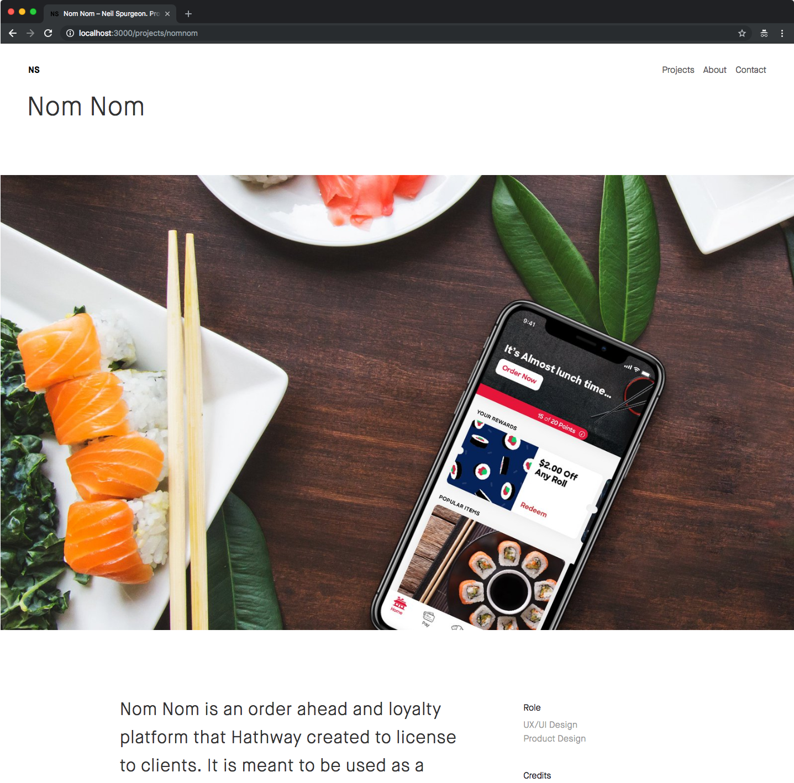

# Portfolio

## Screen Shots

## How it works

Each project requires a data.js file to that stores standard project informations. This data.js file is then imported in to the the `projects/index.js` object array along with the project page component. This array gives us the ability to dynamically loop through all projects.

## What is being used?

- CSS Next syntax through postcss
- CSS Modules
- Waypoints for triggering scroll based animations
